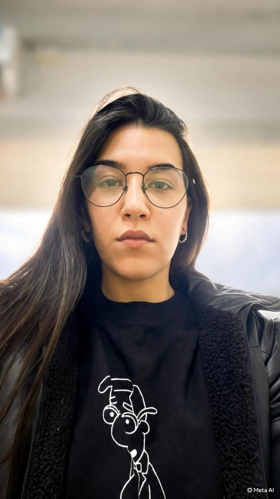
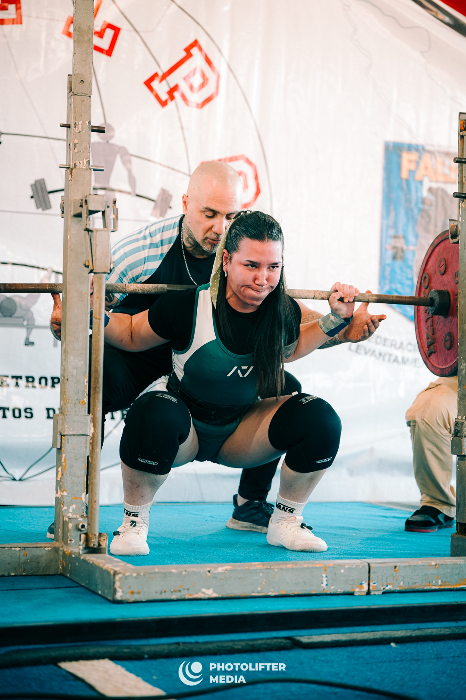

# Programación con objetos I
## Presentación Personal

### 👤 Datos Personales
- Me llamo Barbara Sandivaras y vivo en Haedo, Buenos Aires, Argentina.

### 📚 Formación académica
- Graduada de la Tecnicatura de Instrumentación Quirúrgica, actual estudiante de la  Tecnicatura Universitaria en Programación de la Universidad Nacional de Hurlingham (UNAHUR), con la meta de continuar mis estudios en la Licenciatura en Informatica. 

### 🚀 Propósito:
- Este repositorio representa mi introducción a la materia de Programacion con Objetos de la UNAHUR y en el futuro voy a documentar mis proyectos académicos.

### 🎯 Mis intereses:
- Descrubir nuevas herramientas que me permitan crecer como futura programadora. 

### ✨ Un poco sobre mi
- Fuera de la facultad y el trabajo, disfruto mucho de ir al gimnasio. Me apasiona el levantamiento de pesas, específicamente el **Powerlifting**. Tuve la oportunidad de competir en mayo de 2026, donde logré obtener el **primer puesto** en mi categoría.😊

